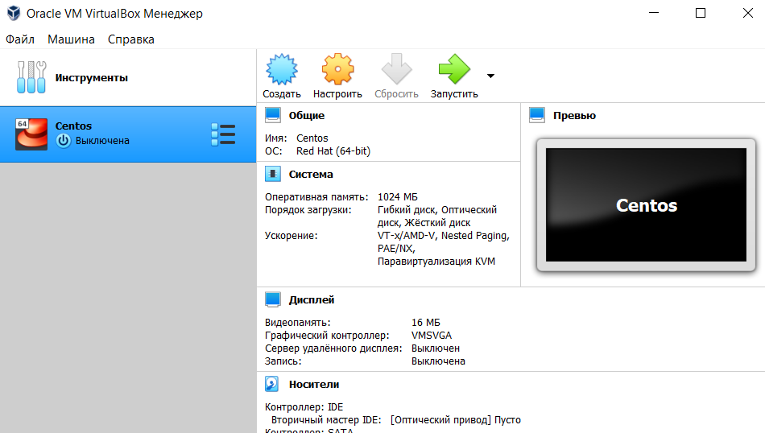
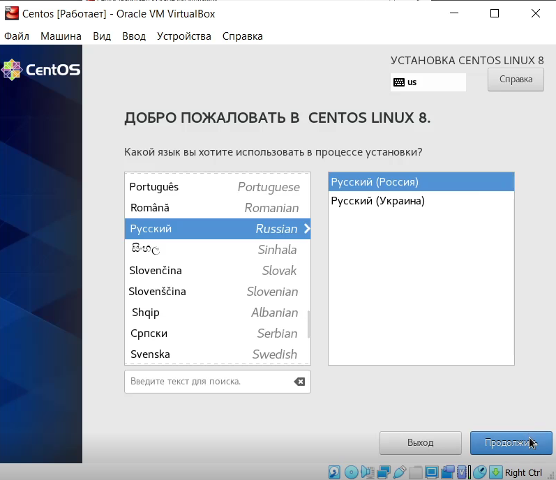
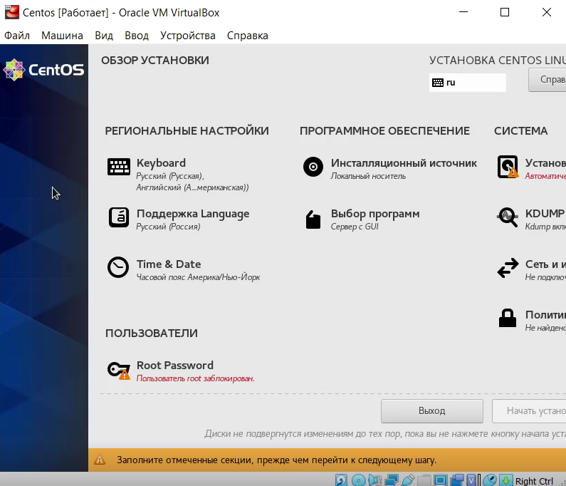
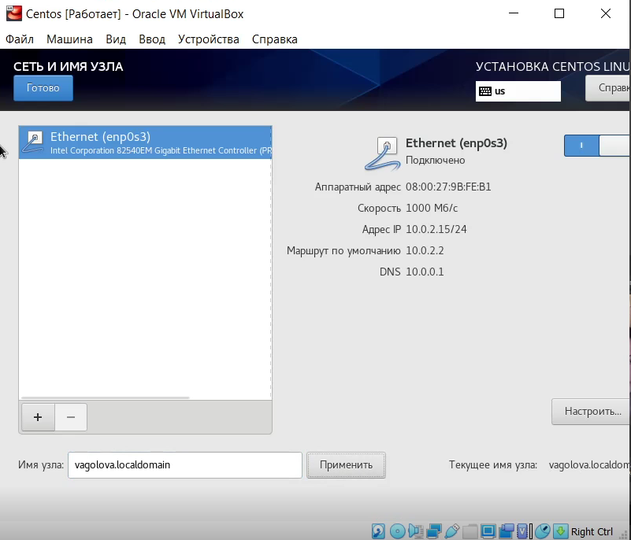
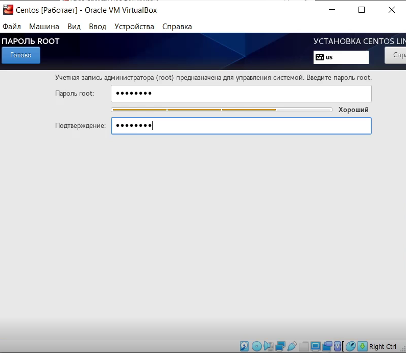
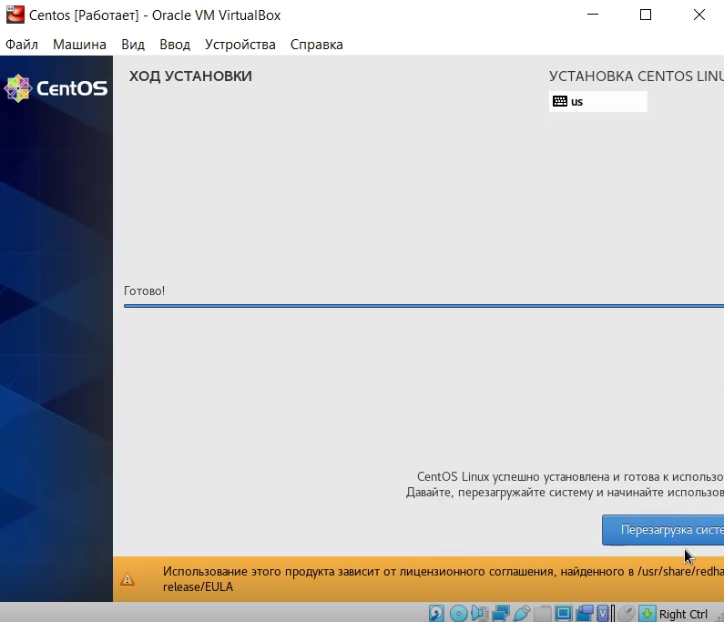
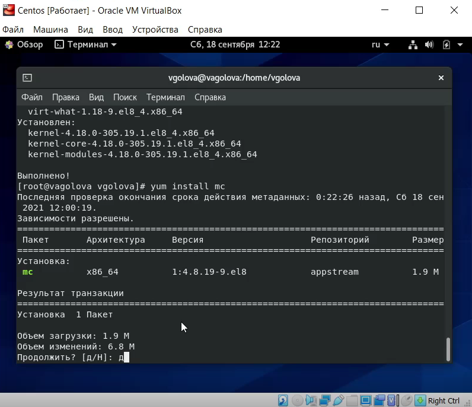

---
## Front matter
title: "Лабораторная работа №1: Установка и конфигурация операционной системы на виртуальную машину"
subtitle: "*дисциплина: Информационная безопасность*"
author: "Голова Варвара Алексеевна"
date: 2021, 18 September

## Formatting
mainfont: PT Serif
romanfont: PT Serif
sansfont: PT Sans
monofont: PT Mono
toc: false
slide_level: 2
theme: metropolis
header-includes:
 - \metroset{progressbar=frametitle,sectionpage=progressbar,numbering=fraction}
 - '\makeatletter'
 - '\beamer@ignorenonframefalse'
 - '\makeatother'
aspectratio: 43
section-titles: true

---

# Цель работы

Приобретение практических навыков установки операционной системы на виртуальную машину, настройки минимально необходимых для дальнейшей работы сервисов.

# Выполнение работы

## Создание виртуальной машины

Имя и тип ОС

{ #fig:001 width=70% }

## Создание виртуальной машины

Объем ОП

{ #fig:002 width=70% }

## Создание виртуальной машины

Жесткий диск

{ #fig:003 width=70% }

## Создание виртуальной машины

Тип

{ #fig:004 width=70% }

## Создание виртуальной машины

Формат хранения

{ #fig:005 width=70% }

## Создание виртуальной машины

Имя и размер файла

{ #fig:006 width=70% }

## CentOS

Виртуальная машина CentOS

{ #fig:007 width=70% }

## Выбор образа оптического диска

Оптический диск

{ #fig:008 width=70% }

## Запуск виртуальной машины

Запуск виртуальной машины CentOS

{ #fig:009 width=70% }

## Установка языка

Установка языка

{ #fig:010 width=70% }

## Обзор установки

Обзор установки

{ #fig:011 width=70% }

## Установка даты и время

Дата и время

{ #fig:012 width=70% }

## Сеть и имя узла

Сеть и имя узла

{ #fig:013 width=70% }

## Установка пароля root

Пароль root

{ #fig:014 width=70% }

## Создание пользователя

Создание пользователя

{ #fig:015 width=70% }

## Завершение установки

Завершение установки

{ #fig:016 width=70% }

## Подключение к виртуальной машине

Подключение к виртуальной машине

{ #fig:017 width=70% }

## Обновление системных файлов

Команда yum update

{ #fig:018 width=70% }

## Установка mc

Установка mc

{ #fig:019 width=70% }

# Выводы

Я приобрела практические навыки установки операционной системы на виртуальную машину и настройки минимально необходимых для дальнейшей работы сервисов.
