---
# Front matter
title: "Отчет по лабораторной работе №1"
subtitle: "Установка и конфигурация операционной системы на виртуальную машину"
author: "Голова Варвара Алексеевна, НФИбд-03-18"
group: "НФИбд-03-18"
ID: "1032182507"
date: 2021, 18 September

# Formatting
toc-title: "Содержание"
toc: true # Table of contents
toc_depth: 2
lof: true # List of figures
fontsize: 12pt
linestretch: 1.5
papersize: a4paper
documentclass: scrreprt
polyglossia-lang: russian
polyglossia-otherlangs: english
mainfont: PT Serif
romanfont: PT Serif
sansfont: PT Sans
monofont: PT Mono
mainfontoptions: Ligatures=TeX
romanfontoptions: Ligatures=TeX
sansfontoptions: Ligatures=TeX,Scale=MatchLowercase
monofontoptions: Scale=MatchLowercase
indent: true
pdf-engine: lualatex
header-includes:
  - \linepenalty=10 # the penalty added to the badness of each line within a paragraph (no associated penalty node) Increasing the value makes tex try to have fewer lines in the paragraph.
  - \interlinepenalty=0 # value of the penalty (node) added after each line of a paragraph.
  - \hyphenpenalty=50 # the penalty for line breaking at an automatically inserted hyphen
  - \exhyphenpenalty=50 # the penalty for line breaking at an explicit hyphen
  - \binoppenalty=700 # the penalty for breaking a line at a binary operator
  - \relpenalty=500 # the penalty for breaking a line at a relation
  - \clubpenalty=150 # extra penalty for breaking after first line of a paragraph
  - \widowpenalty=150 # extra penalty for breaking before last line of a paragraph
  - \displaywidowpenalty=50 # extra penalty for breaking before last line before a display math
  - \brokenpenalty=100 # extra penalty for page breaking after a hyphenated line
  - \predisplaypenalty=10000 # penalty for breaking before a display
  - \postdisplaypenalty=0 # penalty for breaking after a display
  - \floatingpenalty = 20000 # penalty for splitting an insertion (can only be split footnote in standard LaTeX)
  - \raggedbottom # or \flushbottom
  - \usepackage{float} # keep figures where there are in the text
  - \floatplacement{figure}{H} # keep figures where there are in the text
---

# Цель работы

Приобретение практических навыков установки операционной системы на виртуальную машину, настройки минимально необходимых для дальнейшей работы сервисов.

# Выполнение работы

## Создание виртуальной машины

Ввела имя машины - Centos, выбрала тип ОС - Linux.

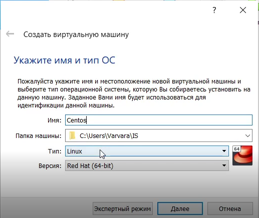{ #fig:001 width=70% }

Выбрала объем оперативной памяти - 1024 МБ.

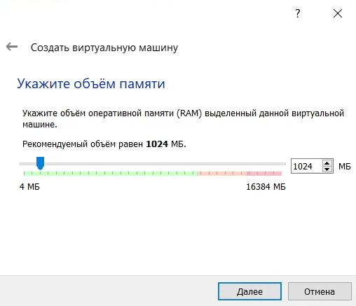{ #fig:002 width=70% }

Выбрала создание нового виртуального жесткого диска.

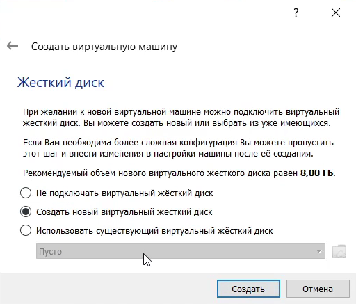{ #fig:003 width=70% }

Указала тип файла - VDI.

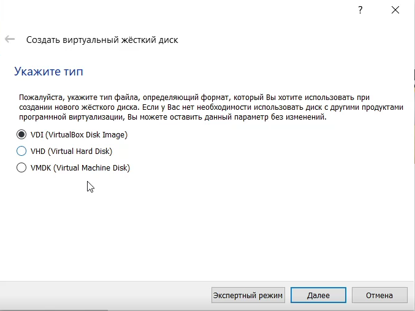{ #fig:004 width=70% }

Указала формат хранения - динамический виртуальный жесткий диск.

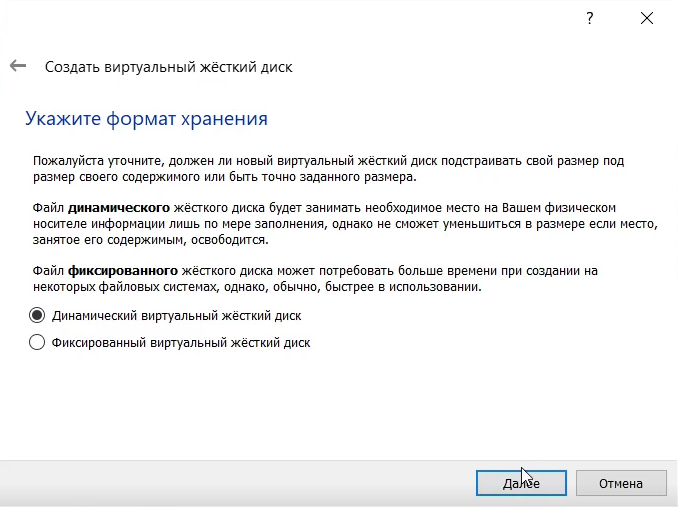{ #fig:005 width=70% }

Указала размер виртуального жесткого диска - 40 ГБ.

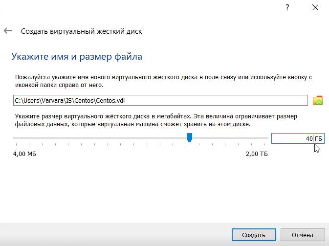{ #fig:006 width=70% }

## CentOS

Таким образом, я создала виртуальную машину CentOS.

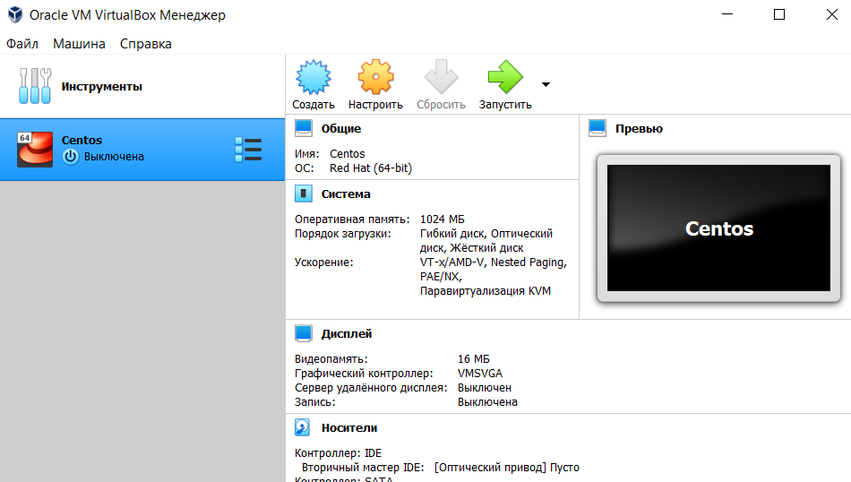{ #fig:007 width=70% }

Выбрала образ оптического диска.

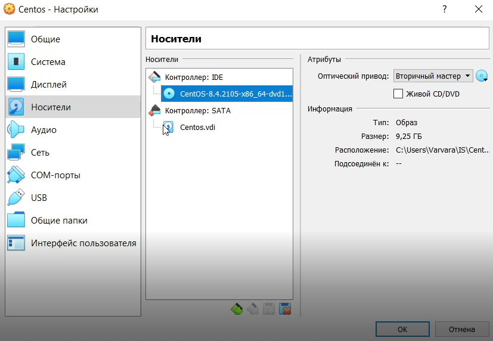{ #fig:008 width=70% }

Запустила виртуальную машину Centos И запустила установку.

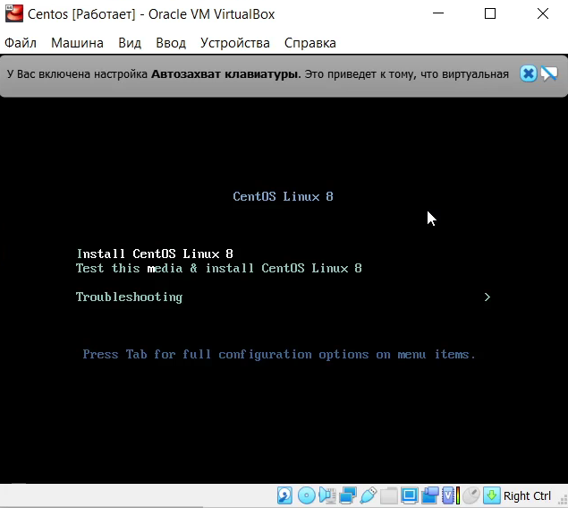{ #fig:009 width=70% }

## Установка языка

Установила русский язык.

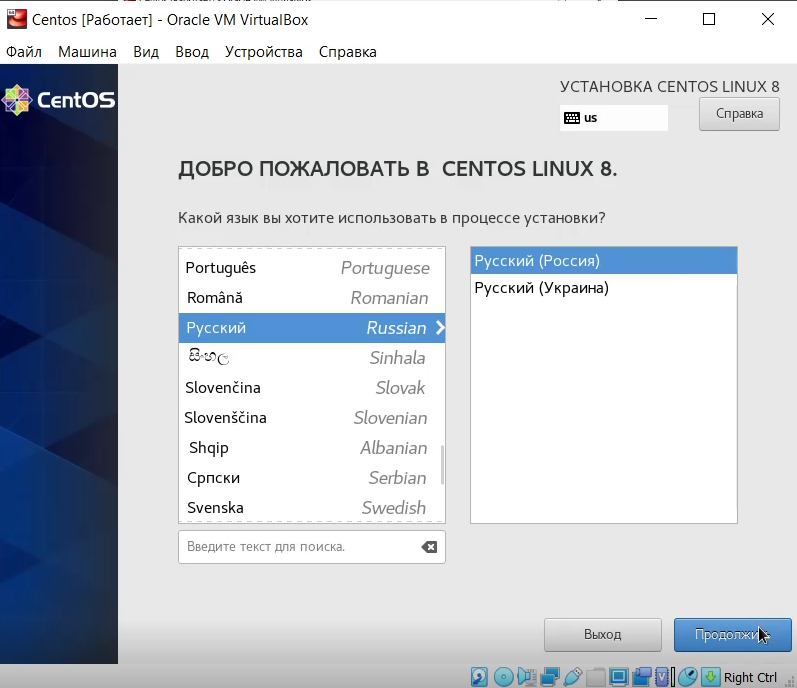{ #fig:010 width=70% }

## Обзор установки

Перешла в окно обзора установки, где проверила язык расскладки клавиатуры - английский и русский, инсталляционный источник - локальный носитель.

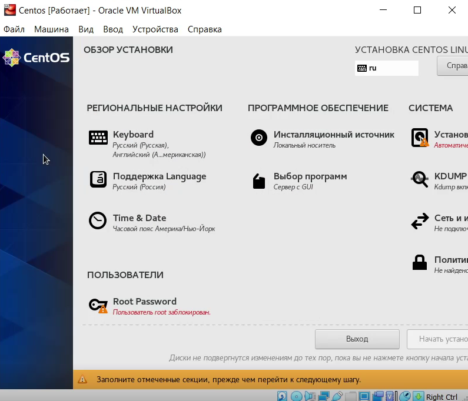{ #fig:011 width=70% }

## Установка даты и время

Установила дату - 18.09.2021, установила время - московское.

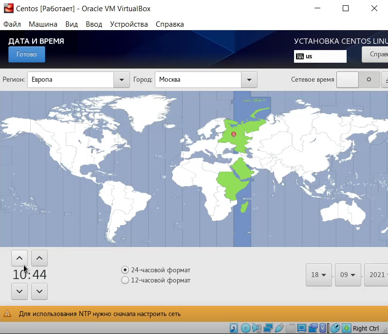{ #fig:012 width=70% }

## Сеть и имя узла

Подключилась к сети и указала имя узла - vagolova.localdomain.

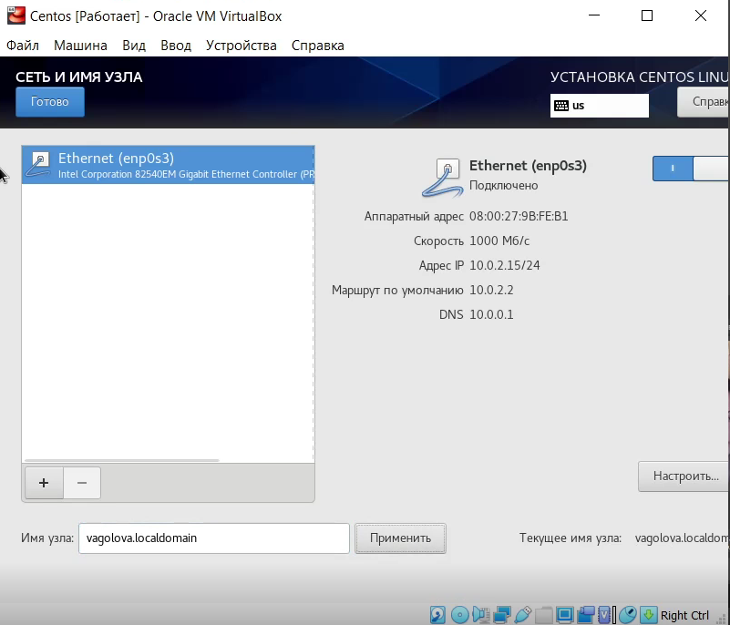{ #fig:013 width=70% }

## Установка пароля root

Придумала и установила пароль root.

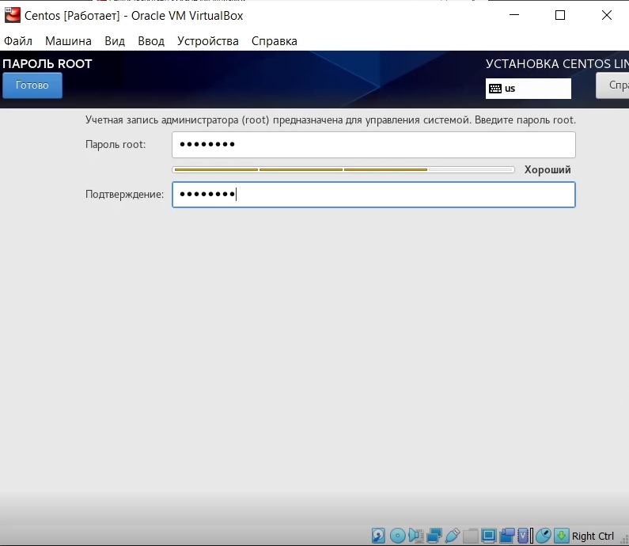{ #fig:014 width=70% }

## Создание пользователя

Создала пользователя, имя которого соответствует моему имени, сделала этого пользователя администратором и установила пароль.

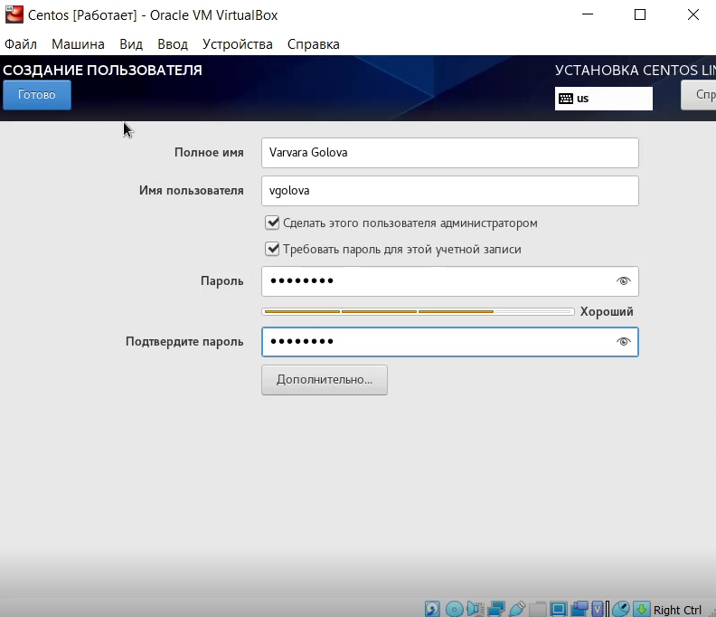{ #fig:015 width=70% }

## Завершение установки

Завершила установку.

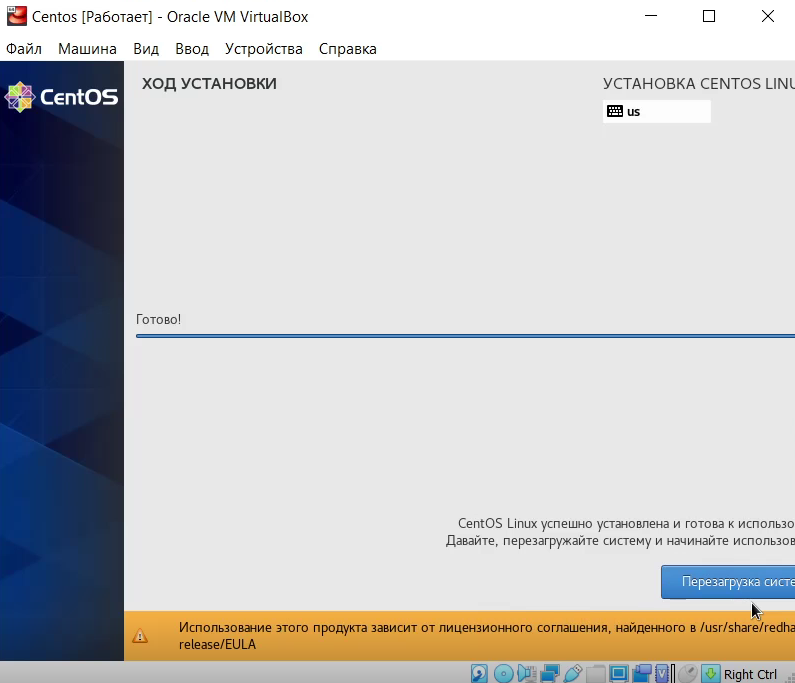{ #fig:016 width=70% }

## Виртуальная машина

Подключилась к виртуальной машине, вошла в систему под своей учетной записью.

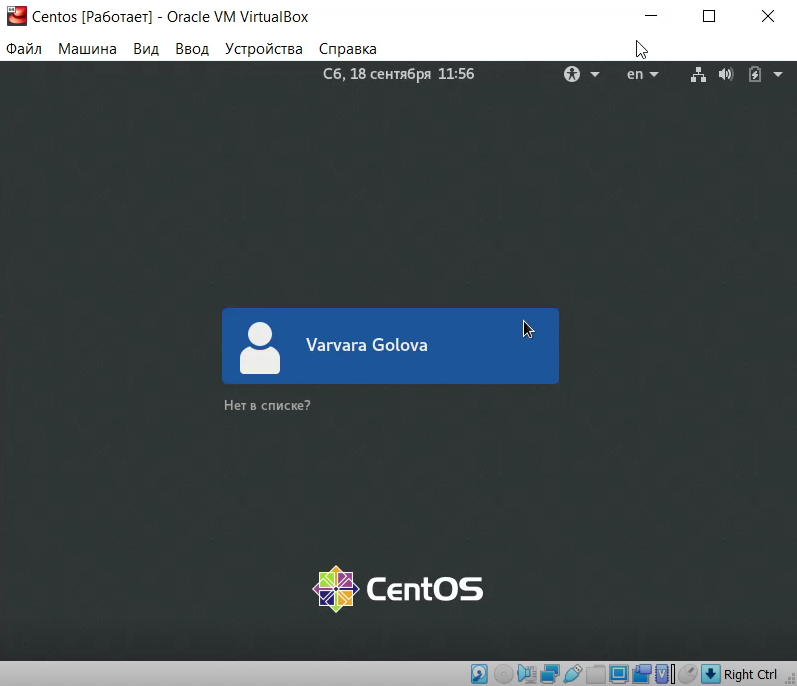{ #fig:017 width=70% }

С помощью команды yum update обновила системные файлы.

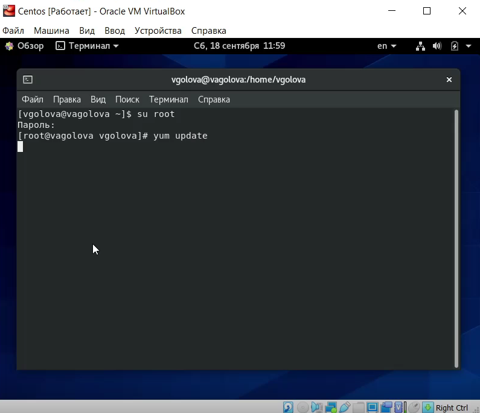{ #fig:018 width=70% }

Установила программу mc.

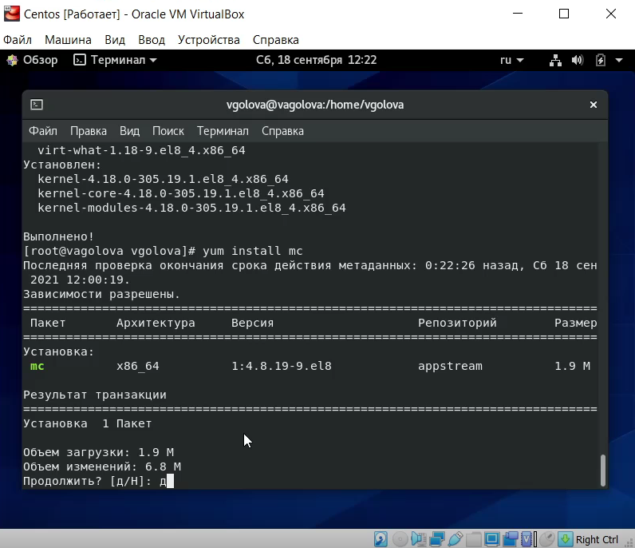{ #fig:019 width=70% }

# Выводы

Я приобрела практические навыки установки операционной системы на виртуальную машину и настройки минимально необходимых для дальнейшей работы сервисов.
