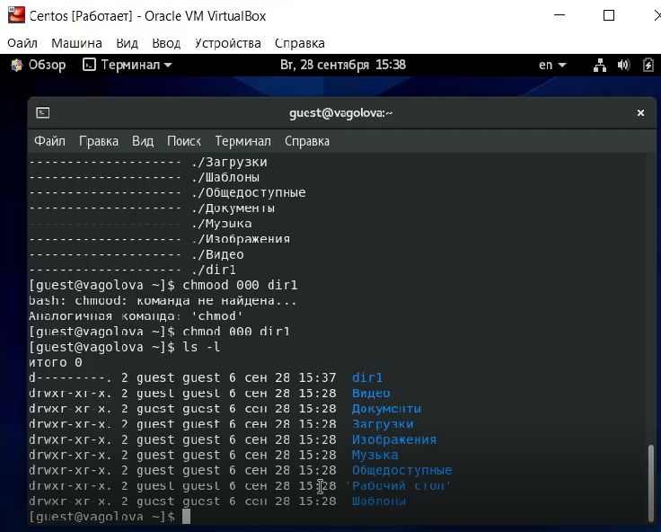

---
## Front matter
title: "Отчет по лабораторной работе №2"
subtitle: "Дискреционное разграничение прав в Linux. Основные атрибуты"
author: "Голова Варвара Алексеевна, НФИбд-03-18"
group: "НФИбд-03-18"
ID: "1032182507"
date: 2021, 02 October

## Formatting
toc-title: "Содержание"
toc: true # Table of contents
toc_depth: 2
lof: true # List of figures
fontsize: 12pt
linestretch: 1.5
papersize: a4paper
documentclass: scrreprt
polyglossia-lang: russian
polyglossia-otherlangs: english
mainfont: PT Serif
romanfont: PT Serif
sansfont: PT Sans
monofont: PT Mono
mainfontoptions: Ligatures=TeX
romanfontoptions: Ligatures=TeX
sansfontoptions: Ligatures=TeX,Scale=MatchLowercase
monofontoptions: Scale=MatchLowercase
indent: true
pdf-engine: lualatex
header-includes:
  - \linepenalty=10 # the penalty added to the badness of each line within a paragraph (no associated penalty node) Increasing the value makes tex try to have fewer lines in the paragraph.
  - \interlinepenalty=0 # value of the penalty (node) added after each line of a paragraph.
  - \hyphenpenalty=50 # the penalty for line breaking at an automatically inserted hyphen
  - \exhyphenpenalty=50 # the penalty for line breaking at an explicit hyphen
  - \binoppenalty=700 # the penalty for breaking a line at a binary operator
  - \relpenalty=500 # the penalty for breaking a line at a relation
  - \clubpenalty=150 # extra penalty for breaking after first line of a paragraph
  - \widowpenalty=150 # extra penalty for breaking before last line of a paragraph
  - \displaywidowpenalty=50 # extra penalty for breaking before last line before a display math
  - \brokenpenalty=100 # extra penalty for page breaking after a hyphenated line
  - \predisplaypenalty=10000 # penalty for breaking before a display
  - \postdisplaypenalty=0 # penalty for breaking after a display
  - \floatingpenalty = 20000 # penalty for splitting an insertion (can only be split footnote in standard LaTeX)
  - \raggedbottom # or \flushbottom
  - \usepackage{float} # keep figures where there are in the text
  - \floatplacement{figure}{H} # keep figures where there are in the text

---

# Цель работы

Получение практических навыков работы в консоли с атрибутами файлов, закрепление теоретических основ дискреционного разграничения доступа в современных системах с открытым кодом на базе ОС Linux.

# Выполнение работы

## Создание учетной записи

В установленной при выполнении предыдущей лабораторной работы операционной системе создала учётную запись пользователя guest (используя учётную запись администратора): useradd guest. Задала пароль для пользователя guest (используя учётную запись администратора): passwd guest.

{ #fig:001 width=70% }

## Учетная запись

Вошла в систему от имени пользователя guest.

{ #fig:002 width=70% }

Определила директорию, в которой я нахожусь, командой pwd. Определила, что она является моей домашней директорией.

{ #fig:003 width=70% }

Уточнила имя моего пользователя командой whoami.

{ #fig:004 width=70% }

Уточнила имя моего пользователя, его группу, а также группы, куда входит пользователь, командой id.

{ #fig:005 width=70% }

Просмотрела файл /etc/passwd командой cat /etc/passwd. Нашла в нём свою учётную запись. Определила uid пользователя. Определила gid пользователя. Сравнила найденные значения с полученными в предыдущих пунктах. Значения одинаковые.

{ #fig:006 width=70% }

Определила существующие в системе директории командой ls -l /home/. Мне удалось получить список поддиректорий директории /home. Установленные права на директориях - drwx--.

{ #fig:007 width=70% }

Проверила, какие расширенные атрибуты установлены на поддиректориях, находящихся в директории /home, командой: lsattr /home. Мне не удалось увидеть расширенные атрибуты директории.

{ #fig:008 width=70% }

Создала в домашней директории поддиректорию dir1 командой mkdir dir1. Определила командами ls -l и lsattr, какие права доступа и расширенные атрибуты были выставлены на директорию dir1 - 000 000.

{ #fig:009 width=70% }

Определила командами ls -l и lsattr, какие права доступа и расширенные атрибуты были выставлены на директорию dir1 - 000 000.

{ #fig:010 width=70% }

Сняла с директории dir1 все атрибуты командой chmod 000 dir1 и проверила с её помощью правильность выполнения команды ls -l.

{ #fig:011 width=70% }

Попыталась создать в директории dir1 файл file1 командой echo "test" > /home/guest/dir1/file1. Я поолучила отказ в выполнении операции по созданию файла, так как было выявлено несоответствие прав директории. Проверила командой ls -l /home/guest/dir1 действительно ли файл file1 не находится внутри директории dir1.

{ #fig:012 width=70% }

## Таблица 2.1

Заполнила таблицу «Установленные права и разрешённые действия», выполняя действия от имени владельца директории (файлов), определив опытным путём, какие операции разрешены, а какие нет. Если операция разрешена, заносила в таблицу знак «+», если не разрешена, знак «-».

{ #fig:013 width=70% }

{ #fig:014 width=70% }

{ #fig:015 width=70% }

## Таблица 2.2

На основании заполненной таблицы определила те или иные минимально необходимые права для выполнения операций внутри директории
dir1, заполнила табл. 2.2.

{ #fig:016 width=70% }

# Выводы

Я получила практические навыки работы в консоли с атрибутами файлов, закрепила теоретические основы дискреционного разграничения доступа в современных системах с открытым кодом на базе ОС Linux.
