---
## Front matter
title: "Лабораторная работа №3: Дискреционное разграничение прав в Linux. Два пользователя"
subtitle: "*дисциплина: Информационная безопасность*"
author: "Голова Варвара Алексеевна"
date: 2021, 16 October

## Formatting
mainfont: PT Serif
romanfont: PT Serif
sansfont: PT Sans
monofont: PT Mono
toc: false
slide_level: 2
theme: metropolis
header-includes:
 - \metroset{progressbar=frametitle,sectionpage=progressbar,numbering=fraction}
 - '\makeatletter'
 - '\beamer@ignorenonframefalse'
 - '\makeatother'
aspectratio: 43
section-titles: true

---

# Цель работы

Получение практических навыков работы в консоли с атрибутами файлов для групп пользователей.

# Выполнение работы

## Создание учетной записи

В установленной при выполнении предыдущей лабораторной работы операционной системе создала учётную запись пользователя guest_1 (используя учётную запись администратора): useradd guest_1. Задала пароль для пользователя guest_1 (используя учётную запись администратора): passwd guest_1.

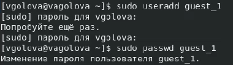{ #fig:001 width=70% }

## Создание учетной записи

В установленной при выполнении предыдущей лабораторной работы операционной системе создала учётную запись пользователя guest_2 (используя учётную запись администратора): useradd guest_2. Задала пароль для пользователя guest_2 (используя учётную запись администратора): passwd guest_2.

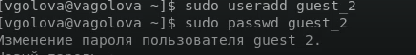{ #fig:002 width=70% }

## Добавление в группу

Добавила пользователя guest_2 в группу guest_1: gpasswd -a guest_2 guest_1

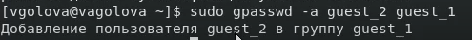{ #fig:003 width=70% }

## Директории

Для обоих пользователей командой pwd определила директорию, в которой я нахожусь.

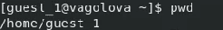{ #fig:004 width=70% }

## Директории

Для обоих пользователей командой pwd определила директорию, в которой я нахожусь.

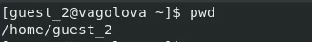{ #fig:005 width=70% }

## Группы

Уточнила имя вашего пользователя, его группу, кто входит в неё и к каким группам принадлежит он сам. Определила командами groups guest_1 и groups guest_2, в какие группы входят пользователи guest_1 и guest_2.

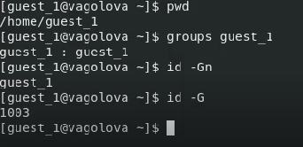{ #fig:006 width=70% }

## Группы

Уточнила имя вашего пользователя, его группу, кто входит в неё и к каким группам принадлежит он сам. Определила командами groups guest_1 и groups guest_2, в какие группы входят пользователи guest_1 и guest_2.

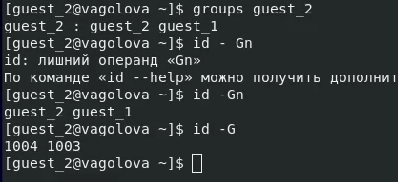{ #fig:007 width=70% }

## Учетная запись

Просмотрела файл /etc/passwd командой cat /etc/passwd. Нашла в нём свои учётные записи.

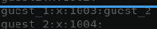{ #fig:008 width=70% }

## Регистрация

От имени пользователя guest_2 выполнила регистрацию пользователя guest_2 в группе guest_1 командой newgrp guest_1

{ #fig:009 width=70% }

## Директория

От имени пользователя guest_1 изменила права директории /home/guest_1, разрешив все действия для пользователей группы: chmod g+rwx /home/guest_1

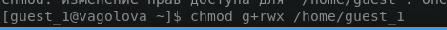{ #fig:010 width=70% }

## Поддиректория

От имени пользователя guest_1 сняла с директории /home/guest_1/dir1 все атрибуты командой chmod 000 dirl

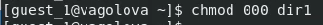{ #fig:011 width=70% }

## Таблица 3.1

Меняя атрибуты у директории dir1 и файла file1 от имени пользователя guest_1 и делая проверку от пользователя guest_2, заполнила таблицу 3.1, определив опытным путём, какие операции разрешены, а какие нет. Если операция разрешена, заносила в таблицу знак «+», если не разрешена, знак «-».

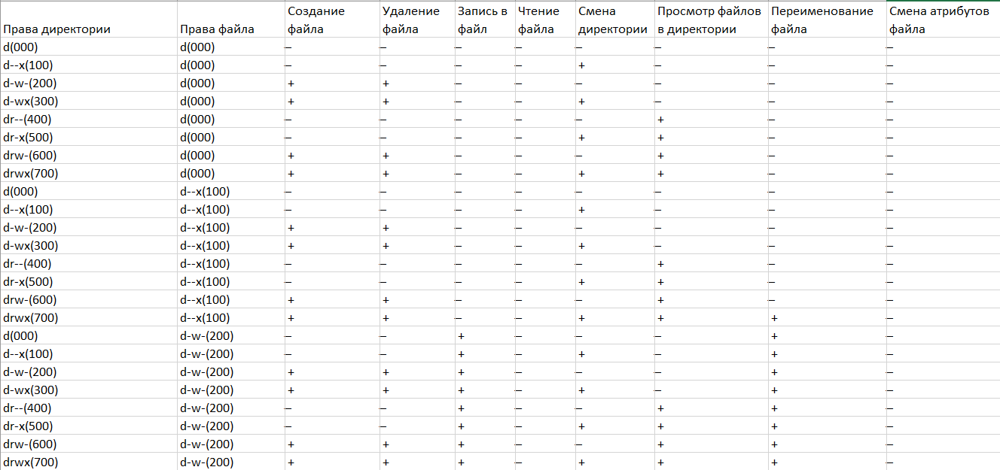{ #fig:012 width=70% }

## Таблица 3.1

Меняя атрибуты у директории dir1 и файла file1 от имени пользователя guest_1 и делая проверку от пользователя guest_2, заполнила таблицу 3.1, определив опытным путём, какие операции разрешены, а какие нет. Если операция разрешена, заносила в таблицу знак «+», если не разрешена, знак «-».

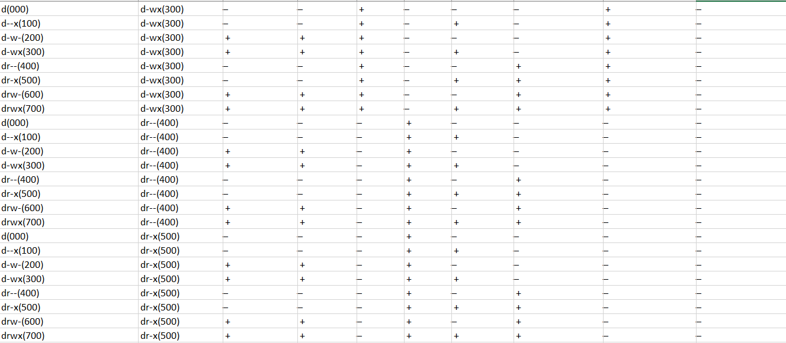{ #fig:013 width=70% }

## Таблица 3.1

Меняя атрибуты у директории dir1 и файла file1 от имени пользователя guest_1 и делая проверку от пользователя guest_2, заполнила таблицу 3.1, определив опытным путём, какие операции разрешены, а какие нет. Если операция разрешена, заносила в таблицу знак «+», если не разрешена, знак «-».

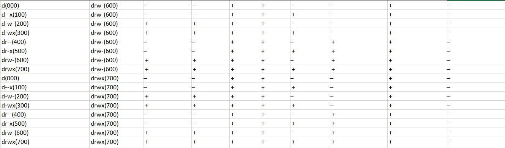{ #fig:014 width=70% }

## Таблица 3.2

На основании заполненной таблицы определила те или иные минимально необходимые права для выполнения пользователем guest_2 операций внутри директории dir1 и заполнила таблицу 3.2.

{ #fig:015 width=70% }

# Выводы

Я получила практические навыки работы в консоли с атрибутами файлов для групп пользователей.
