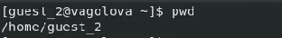
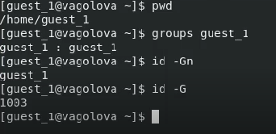
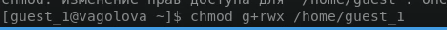
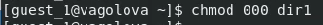

---
## Front matter
title: "Отчет по лабораторной работе №3"
subtitle: "Дискреционное разграничение прав в Linux. Два пользователя"
author: "Голова Варвара Алексеевна, НФИбд-03-18"
group: "НФИбд-03-18"
ID: "1032182507"
date: 2021, 16 October

## Formatting
toc-title: "Содержание"
toc: true # Table of contents
toc_depth: 2
lof: true # List of figures
fontsize: 12pt
linestretch: 1.5
papersize: a4paper
documentclass: scrreprt
polyglossia-lang: russian
polyglossia-otherlangs: english
mainfont: PT Serif
romanfont: PT Serif
sansfont: PT Sans
monofont: PT Mono
mainfontoptions: Ligatures=TeX
romanfontoptions: Ligatures=TeX
sansfontoptions: Ligatures=TeX,Scale=MatchLowercase
monofontoptions: Scale=MatchLowercase
indent: true
pdf-engine: lualatex
header-includes:
  - \linepenalty=10 # the penalty added to the badness of each line within a paragraph (no associated penalty node) Increasing the value makes tex try to have fewer lines in the paragraph.
  - \interlinepenalty=0 # value of the penalty (node) added after each line of a paragraph.
  - \hyphenpenalty=50 # the penalty for line breaking at an automatically inserted hyphen
  - \exhyphenpenalty=50 # the penalty for line breaking at an explicit hyphen
  - \binoppenalty=700 # the penalty for breaking a line at a binary operator
  - \relpenalty=500 # the penalty for breaking a line at a relation
  - \clubpenalty=150 # extra penalty for breaking after first line of a paragraph
  - \widowpenalty=150 # extra penalty for breaking before last line of a paragraph
  - \displaywidowpenalty=50 # extra penalty for breaking before last line before a display math
  - \brokenpenalty=100 # extra penalty for page breaking after a hyphenated line
  - \predisplaypenalty=10000 # penalty for breaking before a display
  - \postdisplaypenalty=0 # penalty for breaking after a display
  - \floatingpenalty = 20000 # penalty for splitting an insertion (can only be split footnote in standard LaTeX)
  - \raggedbottom # or \flushbottom
  - \usepackage{float} # keep figures where there are in the text
  - \floatplacement{figure}{H} # keep figures where there are in the text

---

# Цель работы

Получение практических навыков работы в консоли с атрибутами файлов для групп пользователей.

# Выполнение работы

## Создание учетной записи

В установленной при выполнении предыдущей лабораторной работы операционной системе создала учётную запись пользователя guest_1 (используя учётную запись администратора): useradd guest_1. Задала пароль для пользователя guest_1 (используя учётную запись администратора): passwd guest_1.

{ #fig:001 width=70% }

В установленной при выполнении предыдущей лабораторной работы операционной системе создала учётную запись пользователя guest_2 (используя учётную запись администратора): useradd guest_2. Задала пароль для пользователя guest_2 (используя учётную запись администратора): passwd guest_2.

{ #fig:002 width=70% }

## Добавление в группу

Добавила пользователя guest_2 в группу guest_1: gpasswd -a guest_2 guest_1

{ #fig:003 width=70% }

## Директории

Для обоих пользователей командой pwd определила директорию, в которой я нахожусь. В обоих случаях это домашняя директория.

{ #fig:004 width=70% }

{ #fig:005 width=70% }

## Группы

Уточнила имя вашего пользователя, его группу, кто входит в неё и к каким группам принадлежит он сам. Определила командами groups guest_1 и groups guest_2, в какие группы входят пользователи guest_1 и guest_2.

{ #fig:006 width=70% }

{ #fig:007 width=70% }

## Учетная запись

Просмотрела файл /etc/passwd командой cat /etc/passwd. Нашла в нём свои учётные записи.

{ #fig:008 width=70% }

## Регистрация

От имени пользователя guest_2 выполнила регистрацию пользователя guest_2 в группе guest_1 командой newgrp guest_1

{ #fig:009 width=70% }

## Директория

От имени пользователя guest_1 изменила права директории /home/guest_1, разрешив все действия для пользователей группы: chmod g+rwx /home/guest_1

{ #fig:010 width=70% }

## Поддиректория

От имени пользователя guest_1 сняла с директории /home/guest_1/dir1 все атрибуты командой chmod 000 dirl

{ #fig:011 width=70% }

## Таблица 3.1

Меняя атрибуты у директории dir1 и файла file1 от имени пользователя guest_1 и делая проверку от пользователя guest_2, заполнила таблицу 3.1, определив опытным путём, какие операции разрешены, а какие нет. Если операция разрешена, заносила в таблицу знак «+», если не разрешена, знак «-».

{ #fig:012 width=70% }

{ #fig:013 width=70% }

{ #fig:014 width=70% }

## Таблица 3.2

На основании заполненной таблицы определила те или иные минимально необходимые права для выполнения пользователем guest_2 операций внутри директории dir1 и заполнила таблицу 3.2.

{ #fig:015 width=70% }

# Выводы

Я получила практические навыки работы в консоли с атрибутами файлов для групп пользователей.
