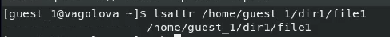
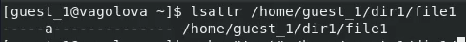
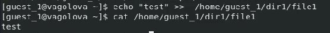

---
## Front matter
title: "Лабораторная работа №4: Дискреционное разграничение прав в Linux. Расширенные атрибуты"
subtitle: "*дисциплина: Информационная безопасность*"
author: "Голова Варвара Алексеевна"
date: 2021, 29 October

## Formatting
mainfont: PT Serif
romanfont: PT Serif
sansfont: PT Sans
monofont: PT Mono
toc: false
slide_level: 2
theme: metropolis
header-includes:
 - \metroset{progressbar=frametitle,sectionpage=progressbar,numbering=fraction}
 - '\makeatletter'
 - '\beamer@ignorenonframefalse'
 - '\makeatother'
aspectratio: 43
section-titles: true

---

# Цель работы

Получение практических навыков работы в консоли с расширенными атрибутами файлов.

# Выполнение работы

## Расширинные атрибуты

От имени пользователя guest_1 определила расширенные атрибуты файла /home/guest_1/dir1/file1 командой lsattr /home/guest_1/dir1/file1

{ #fig:001 width=70% }

## Установка прав

Установила командой chmod 600 file1 на файл file1 права, разрешающие чтение и запись для владельца файла.

{ #fig:002 width=70% }

## Расширенный атрибут a

Попробовала установить на файл /home/guest_1/dir1/file1 расширенный атрибут a от имени пользователя guest_1: chattr +a /home/guest_1/dir1/file1. В ответ я получила отказ от выполнения операции.

{ #fig:003 width=70% }

## Суперпользователь

Повысила свои права с помощью команды su. Попробовала установить расширенный атрибут a на файл /home/guest_1/dir1/file1 от имени суперпользователя: chattr +a /home/guest_1/dir1/file1

{ #fig:004 width=70% }

## Проверка

От пользователя guest_1 проверила правильность установления атрибута: lsattr /home/guest_1/dir1/file1

{ #fig:005 width=70% }

## Дозапись в file1

Выполнила дозапись в файл file1 слова «test» командой echo "test" /home/guest_1/dir1/file1. После этого выполнила чтение файла file1 командой cat /home/guest_1/dir1/file1. Убедилась, что слово test было успешно записано в file1.

{ #fig:006 width=70% }

## Переименование файла

Попробовала стереть имеющуюся в нём информацию командой echo "abcd" > /home/guest_1/dirl/file1. Попробовала переименовать файл.

{ #fig:007 width=70% }

## Установка прав

Попробовала с помощью команды chmod 000 file1 установить на файл file1 права, например, запрещающие чтение и запись для владельца файла.

{ #fig:008 width=70% }

## Снятие атрибута a

Сняла расширенный атрибут a с файла /home/guest_1/dirl/file1 от имени суперпользователя командой chattr -a /home/guest_1/dir1/file1. Повторила операции, которые мне ранее не удавалось выполнить.

{ #fig:009 width=70% }

## Атрибут i

Повторила мои действия по шагам, заменив атрибут «a» атрибутом «i».

{ #fig:010 width=70% }

## Атрибут i

Повторила мои действия по шагам, заменив атрибут «a» атрибутом «i».

{ #fig:011 width=70% }

## Атрибут i

Повторила мои действия по шагам, заменив атрибут «a» атрибутом «i».

{ #fig:012 width=70% }

# Выводы

Я получила практические навыки работы в консоли с расширенными атрибутами файлов. Опробовала действие на практике расширенных атрибутов «а» и «i».
