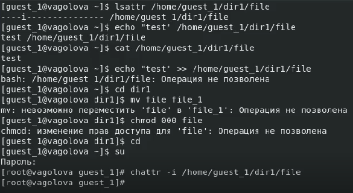

---
## Front matter
title: "Отчет по лабораторной работе №4"
subtitle: "Лабораторная работа №4: Дискреционное разграничение прав в Linux. Расширенные атрибуты"
author: "Голова Варвара Алексеевна, НФИбд-03-18"
group: "НФИбд-03-18"
ID: "1032182507"
date: 2021, 29 October

## Formatting
toc-title: "Содержание"
toc: true # Table of contents
toc_depth: 2
lof: true # List of figures
fontsize: 12pt
linestretch: 1.5
papersize: a4paper
documentclass: scrreprt
polyglossia-lang: russian
polyglossia-otherlangs: english
mainfont: PT Serif
romanfont: PT Serif
sansfont: PT Sans
monofont: PT Mono
mainfontoptions: Ligatures=TeX
romanfontoptions: Ligatures=TeX
sansfontoptions: Ligatures=TeX,Scale=MatchLowercase
monofontoptions: Scale=MatchLowercase
indent: true
pdf-engine: lualatex
header-includes:
  - \linepenalty=10 # the penalty added to the badness of each line within a paragraph (no associated penalty node) Increasing the value makes tex try to have fewer lines in the paragraph.
  - \interlinepenalty=0 # value of the penalty (node) added after each line of a paragraph.
  - \hyphenpenalty=50 # the penalty for line breaking at an automatically inserted hyphen
  - \exhyphenpenalty=50 # the penalty for line breaking at an explicit hyphen
  - \binoppenalty=700 # the penalty for breaking a line at a binary operator
  - \relpenalty=500 # the penalty for breaking a line at a relation
  - \clubpenalty=150 # extra penalty for breaking after first line of a paragraph
  - \widowpenalty=150 # extra penalty for breaking before last line of a paragraph
  - \displaywidowpenalty=50 # extra penalty for breaking before last line before a display math
  - \brokenpenalty=100 # extra penalty for page breaking after a hyphenated line
  - \predisplaypenalty=10000 # penalty for breaking before a display
  - \postdisplaypenalty=0 # penalty for breaking after a display
  - \floatingpenalty = 20000 # penalty for splitting an insertion (can only be split footnote in standard LaTeX)
  - \raggedbottom # or \flushbottom
  - \usepackage{float} # keep figures where there are in the text
  - \floatplacement{figure}{H} # keep figures where there are in the text

---

# Цель работы

Получение практических навыков работы в консоли с расширенными атрибутами файлов.

# Выполнение работы

## Расширинные атрибуты

От имени пользователя guest_1 определила расширенные атрибуты файла /home/guest_1/dir1/file1 командой lsattr /home/guest_1/dir1/file1

{ #fig:001 width=70% }

## Установка прав

Установила командой chmod 600 file1 на файл file1 права, разрешающие чтение и запись для владельца файла.

{ #fig:002 width=70% }

## Расширенный атрибут a

Попробовала установить на файл /home/guest_1/dir1/file1 расширенный атрибут a от имени пользователя guest_1: chattr +a /home/guest_1/dir1/file1. В ответ я получила отказ от выполнения операции.

{ #fig:003 width=70% }

## Суперпользователь

Повысила свои права с помощью команды su. Попробовала установить расширенный атрибут a на файл /home/guest_1/dir1/file1 от имени суперпользователя: chattr +a /home/guest_1/dir1/file1

{ #fig:004 width=70% }

## Проверка

От пользователя guest_1 проверила правильность установления атрибута: lsattr /home/guest_1/dir1/file1. Установка прошла успешно.

{ #fig:005 width=70% }

## Дозапись в file1

Выполнила дозапись в файл file1 слова «test» командой echo "test" /home/guest_1/dir1/file1. После этого выполнила чтение файла file1 командой cat /home/guest_1/dir1/file1. Убедилась, что слово test было успешно записано в file1.

{ #fig:006 width=70% }

## Переименование файла

Попробовала стереть имеющуюся в нём информацию командой echo "abcd" > /home/guest_1/dirl/file1. Попробовала переименовать файл. Операция была отклонена.

{ #fig:007 width=70% }

## Установка прав

Попробовала с помощью команды chmod 000 file1 установить на файл file1 права, например, запрещающие чтение и запись для владельца файла. Эта операция также была отклонена.

{ #fig:008 width=70% }

## Снятие атрибута a

Сняла расширенный атрибут a с файла /home/guest_1/dirl/file1 от имени суперпользователя командой chattr -a /home/guest_1/dir1/file1. Повторила операции, которые мне ранее не удавалось выполнить. На этот раз все выполнить удалось. Файл file1 я переименовала в file.

{ #fig:009 width=70% }

## Атрибут i

Повторила мои действия по шагам, заменив атрибут «a» атрибутом «i». Вновь дозаписать файл file не удалось, в процессе переименования file стал называться file_1.

{ #fig:010 width=70% }

{ #fig:011 width=70% }

{ #fig:012 width=70% }

# Выводы

Я получила практические навыки работы в консоли с расширенными атрибутами файлов. Опробовала действие на практике расширенных атрибутов «а» и «i».
