---
## Front matter
title: "Лабораторная работа №5: Дискреционное разграничение прав в Linux. Исследование влияния дополнительных атрибутов"
subtitle: "*дисциплина: Информационная безопасность*"
author: "Голова Варвара Алексеевна"
date: 2021, 13 November

## Formatting
mainfont: PT Serif
romanfont: PT Serif
sansfont: PT Sans
monofont: PT Mono
toc: false
slide_level: 2
theme: metropolis
header-includes:
 - \metroset{progressbar=frametitle,sectionpage=progressbar,numbering=fraction}
 - '\makeatletter'
 - '\beamer@ignorenonframefalse'
 - '\makeatother'
aspectratio: 43
section-titles: true

---

# Цель работы

Изучение механизмов изменения идентификаторов, применения SetUID- и Sticky-битов. Получение практических навыков работы в консоли с дополнительными атрибутами. Рассмотрение работы механизма смены идентификатора процессов пользователей, а также влияние бита Sticky на запись и удаление файлов.

# Выполнение работы

## Создание программы

Создала программу simpleid.c:

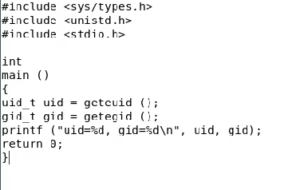{ #fig:001 width=70% }

## Компиляция

Скомплилировала программу и убедилась, что файл программы создан

{ #fig:002 width=70% }

## Выполнение программы

Выполнила программу simpleid

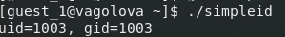{ #fig:003 width=70% }

## Программа id

Выполнила системную программу id

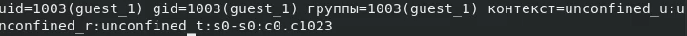{ #fig:004 width=70% }

## Программа

Усложнила программу, добавив вывод действительных идентификаторов, получившуюся программу назвала simpleid2.c.

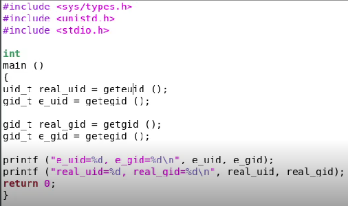{ #fig:005 width=70% }

## Компиляция

Скомпилировала simpleid2.c

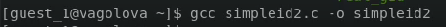{ #fig:006 width=70% }

## Суперпользователь

От имени суперпользователя выполнила команды

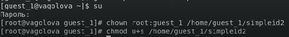{ #fig:007 width=70% }

## Проверка

Выполнила проверку правильности установки новых атрибутов и смены владельца файла simpleid2:

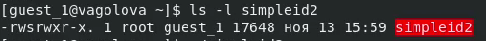{ #fig:008 width=70% }

## Программы

Запустила simpleid2 и id

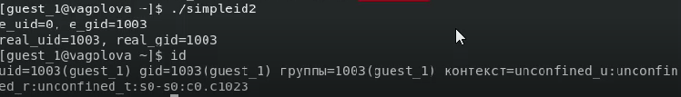{ #fig:009 width=70% }

## Программа

Создала программу readfile.c

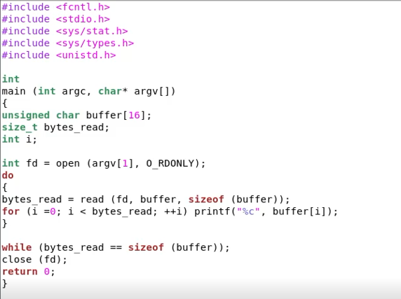{ #fig:010 width=70% }

## Права readfile.c

Сменила владельца у файла readfile.c и изменила права так, чтобы только суперпользователь мог прочитать его, a guest_1 не мог. Проверила, что пользователь guest_1 не может прочитать файл readfile.c. Сменила у программы readfile владельца и установите SetU’D-бит.

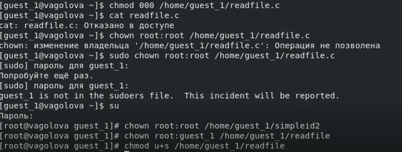{ #fig:011 width=70% }

## Атрибуты

Выяснила, установлен ли атрибут Sticky на директории /tmp. От имени пользователя guest_1 создала файл file01.txt в директории /tmp со словом test. Просмотрела атрибуты у только что созданного файла и разрешила чтение и запись для категории пользователей «все остальные»

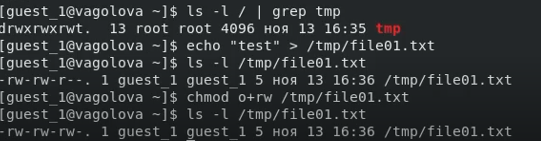{ #fig:012 width=70% }

## File01

От пользователя guest_2 попробовала прочитать файл /tmp/file01.txt. От пользователя guest_2 попробовала дозаписать в файл
/tmp/file01.txt слово test2. Проверила содержимое файла командой. От пользователя guest_2 попробовала записать в файл /tmp/file01.txt слово test3, стерев при этом всю имеющуюся в файле информацию. Проверила содержимое файла командой. От пользователя guest_2 попробовала удалить файл /tmp/file01.txt. Повысила свои права до суперпользователя и выполнила после этого команду, снимающую атрибут t (Sticky-бит) с директории /tmp. Покинула режим суперпользователя. От пользователя guest_2 проверила, что атрибута t у директории /tmp нет.

{ #fig:013 width=70% }

## Атрибут t

Повторила предыдущие шаги. Мне удалось удалить файл от имени пользователя, не являющегося его владельцем. Повысила свои права до суперпользователя и вернула атрибут t на директорию /tmp.

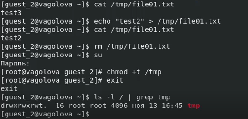{ #fig:014 width=70% }

# Выводы

Я изучила механизмы изменения идентификаторов, применения SetUID- и Sticky-битов. Получила практические навыки работы в консоли с дополнительными атрибутами. Рассмотрела работы механизма смены идентификатора процессов пользователей, а также влияние бита Sticky на запись и удаление файлов.
