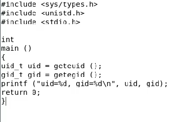
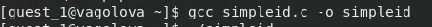
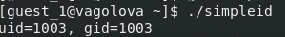
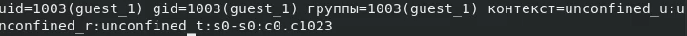
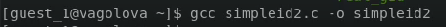

---
## Front matter
title: "Отчет по лабораторной работе №5"
subtitle: "Лабораторная работа №5: Дискреционное разграничение прав в Linux. Исследование влияния дополнительных атрибутов"
author: "Голова Варвара Алексеевна, НФИбд-03-18"
group: "НФИбд-03-18"
ID: "1032182507"
date: 2021, 13 November

## Formatting
toc-title: "Содержание"
toc: true # Table of contents
toc_depth: 2
lof: true # List of figures
fontsize: 12pt
linestretch: 1.5
papersize: a4paper
documentclass: scrreprt
polyglossia-lang: russian
polyglossia-otherlangs: english
mainfont: PT Serif
romanfont: PT Serif
sansfont: PT Sans
monofont: PT Mono
mainfontoptions: Ligatures=TeX
romanfontoptions: Ligatures=TeX
sansfontoptions: Ligatures=TeX,Scale=MatchLowercase
monofontoptions: Scale=MatchLowercase
indent: true
pdf-engine: lualatex
header-includes:
  - \linepenalty=10 # the penalty added to the badness of each line within a paragraph (no associated penalty node) Increasing the value makes tex try to have fewer lines in the paragraph.
  - \interlinepenalty=0 # value of the penalty (node) added after each line of a paragraph.
  - \hyphenpenalty=50 # the penalty for line breaking at an automatically inserted hyphen
  - \exhyphenpenalty=50 # the penalty for line breaking at an explicit hyphen
  - \binoppenalty=700 # the penalty for breaking a line at a binary operator
  - \relpenalty=500 # the penalty for breaking a line at a relation
  - \clubpenalty=150 # extra penalty for breaking after first line of a paragraph
  - \widowpenalty=150 # extra penalty for breaking before last line of a paragraph
  - \displaywidowpenalty=50 # extra penalty for breaking before last line before a display math
  - \brokenpenalty=100 # extra penalty for page breaking after a hyphenated line
  - \predisplaypenalty=10000 # penalty for breaking before a display
  - \postdisplaypenalty=0 # penalty for breaking after a display
  - \floatingpenalty = 20000 # penalty for splitting an insertion (can only be split footnote in standard LaTeX)
  - \raggedbottom # or \flushbottom
  - \usepackage{float} # keep figures where there are in the text
  - \floatplacement{figure}{H} # keep figures where there are in the text

---

# Цель работы

Изучение механизмов изменения идентификаторов, применения SetUID- и Sticky-битов. Получение практических навыков работы в консоли с дополнительными атрибутами. Рассмотрение работы механизма смены идентификатора процессов пользователей, а также влияние бита Sticky на запись и удаление файлов.

# Выполнение работы

## Создание программы

Создала программу simpleid.c:

{ #fig:001 width=70% }

## Компиляция

Скомплилировала программу и убедилась, что файл программы создан.

{ #fig:002 width=70% }

Выполнила программу simpleid.

{ #fig:003 width=70% }

Выполнила системную программу id. Результаты совпадают.

{ #fig:004 width=70% }

## Программа

Усложнила программу, добавив вывод действительных идентификаторов, получившуюся программу назвала simpleid2.c.

{ #fig:005 width=70% }

## Компиляция

Скомпилировала simpleid2.c

{ #fig:006 width=70% }

От имени суперпользователя выполнила команды. Команда su позволяет выполнять команды от имени суперпользователя.

{ #fig:007 width=70% }

Выполнила проверку правильности установки новых атрибутов и смены владельца файла simpleid2:

{ #fig:008 width=70% }

Запустила simpleid2 и id. Результаты совпадают.

{ #fig:009 width=70% }

## Программа readfile.c

Создала программу readfile.c

{ #fig:010 width=70% }

Сменила владельца у файла readfile.c и изменила права так, чтобы только суперпользователь мог прочитать его, a guest_1 не мог. Проверила, что пользователь guest_1 не может прочитать файл readfile.c. Сменила у программы readfile владельца и установите SetU’D-бит.

{ #fig:011 width=70% }

## Атрибуты

Выяснила, установлен ли атрибут Sticky на директории /tmp. Атрибут установлен. От имени пользователя guest_1 создала файл file01.txt в директории /tmp со словом test. Просмотрела атрибуты у только что созданного файла и разрешила чтение и запись для категории пользователей «все остальные»

{ #fig:012 width=70% }

От пользователя guest_2 попробовала прочитать файл /tmp/file01.txt. Это удалось. От пользователя guest_2 попробовала дозаписать в файл /tmp/file01.txt слово test2. Это также удалось. Проверила содержимое файла командой. От пользователя guest_2 попробовала записать в файл /tmp/file01.txt слово test3, стерев при этом всю имеющуюся в файле информацию. Проверила содержимое файла командой. От пользователя guest_2 попробовала удалить файл /tmp/file01.txt. Это не удалось. Повысила свои права до суперпользователя и выполнила после этого команду, снимающую атрибут t (Sticky-бит) с директории /tmp. Покинула режим суперпользователя. От пользователя guest_2 проверила, что атрибута t у директории /tmp нет.

{ #fig:013 width=70% }

Повторила предыдущие шаги. Мне удалось удалить файл от имени пользователя, не являющегося его владельцем. Повысила свои права до суперпользователя и вернула атрибут t на директорию /tmp.

{ #fig:014 width=70% }

# Выводы

Я изучила механизмы изменения идентификаторов, применения SetUID- и Sticky-битов. Получила практические навыки работы в консоли с дополнительными атрибутами. Рассмотрела работы механизма смены идентификатора процессов пользователей, а также влияние бита Sticky на запись и удаление файлов.
