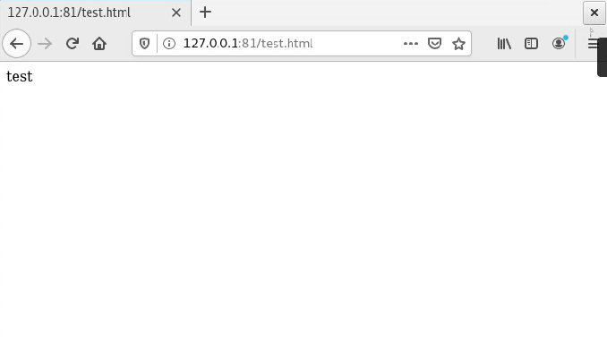

---
## Front matter
title: "Лабораторная работа №6: Мандатное разграничение прав в Linux"
subtitle: "*дисциплина: Информационная безопасность*"
author: "Голова Варвара Алексеевна"
date: 2021, 25 November

## Formatting
mainfont: PT Serif
romanfont: PT Serif
sansfont: PT Sans
monofont: PT Mono
toc: false
slide_level: 2
theme: metropolis
header-includes:
 - \metroset{progressbar=frametitle,sectionpage=progressbar,numbering=fraction}
 - '\makeatletter'
 - '\beamer@ignorenonframefalse'
 - '\makeatother'
aspectratio: 43
section-titles: true

---

# Цель работы

Развить навыки администрирования ОС Linux. Получить первое практическое знакомство с технологией SELinux. Проверить работу SELinux на практике совместно с веб-сервером Apache.

# Выполнение работы

## SELinux

Убедилась, что SELinux работает в режиме enforcing политики targeted с помощью команд getenforce и sestatus.

{ #fig:001 width=70% }

## Веб-сервер

Обратилась с помощью браузера к веб-серверу, запущенному на моем компьютере, и убедилась, что последний работает, предварительно запустив его.

{ #fig:002 width=70% }

## Веб-сервер Apache

Нашла веб-сервер Apache в списке процессов, определила его контекст безопасности и занесла эту информацию в отчёт.

{ #fig:003 width=70% }

## Текущее состояние переключателей

Посмотрела текущее состояние переключателей SELinux для Apache с помощью команды sestatus -bigrep httpd. Обратила внимание, что многие из них находятся в положении «off».

{ #fig:004 width=70% }

## Статистика

Посмотрела статистику по политике с помощью команды seinfo.

{ #fig:005 width=70% }

## Директория

Определила тип файлов и поддиректорий, находящихся в директории /var/www.

{ #fig:006 width=70% }

## Test.html

Создала от имени суперпользователя html-файл /var/www/html/test.html.

{ #fig:007 width=70% }

## Контекст файла

Проверила контекст созданного мной файла.

{ #fig:008 width=70% }

## Отображение в браузере

Обратилась к файлу через веб-сервер, введя в браузере адрес http://127.0.0.1/test.html. Убедилась, что файл был успешно отображён.

{ #fig:009 width=70% }

## Изменение контекста

Изменила контекст файла /var/www/html/test.html с httpd_sys_content_t на samba_share_t.

{ #fig:010 width=70% }

## Веб-сервер

Попробовала ещё раз получить доступ к файлу через веб-сервер, введя в браузере адрес http://127.0.0.1/test.html. Получила сообщение об ошибке.

{ #fig:011 width=70% }

## Log-файлы

Просмотрела log-файлы веб-сервера Apache. Также просмотрела системный лог-файл.

{ #fig:012 width=70% }

## TCP-порт

Попробовала запустить веб-сервер Apache на прослушивание ТСР-порта 81. Для этого в файле /etc/httpd/httpd.conf нашла строчку Listen 80 и заменила её на Listen 81.

{ #fig:013 width=70% }

## Отображение в браузере

Вернула контекст httpd_sys_cоntent__t к файлу /var/www/html/ test.html. После этого попробовала получить доступ к файлу через веб-сервер, введя в браузере адрес http://127.0.0.1:81/test.html.

{ #fig:014 width=70% }

## TCP-порт

Исправила обратно конфигурационный файл apache, вернув Listen 80. Удалила привязку http_port_t к 81 порту и проверила, что порт 81 удалён. Затем удалила файл /var/www/html/test.html.

{ #fig:015 width=70% }

# Выводы

Я развила навыки администрирования ОС Linux. Получила первое практическое знакомство с технологией SELinux. Проверила работу SELinux на практике совместно с веб-сервером Apache.
