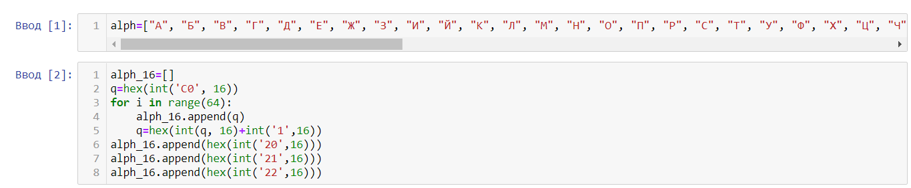
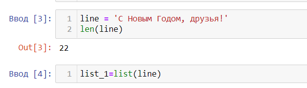
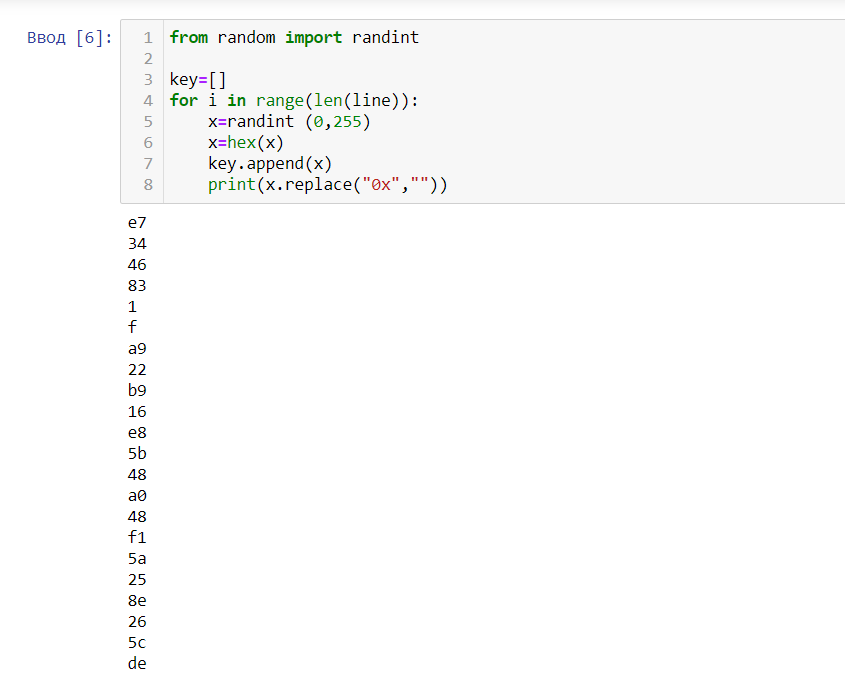
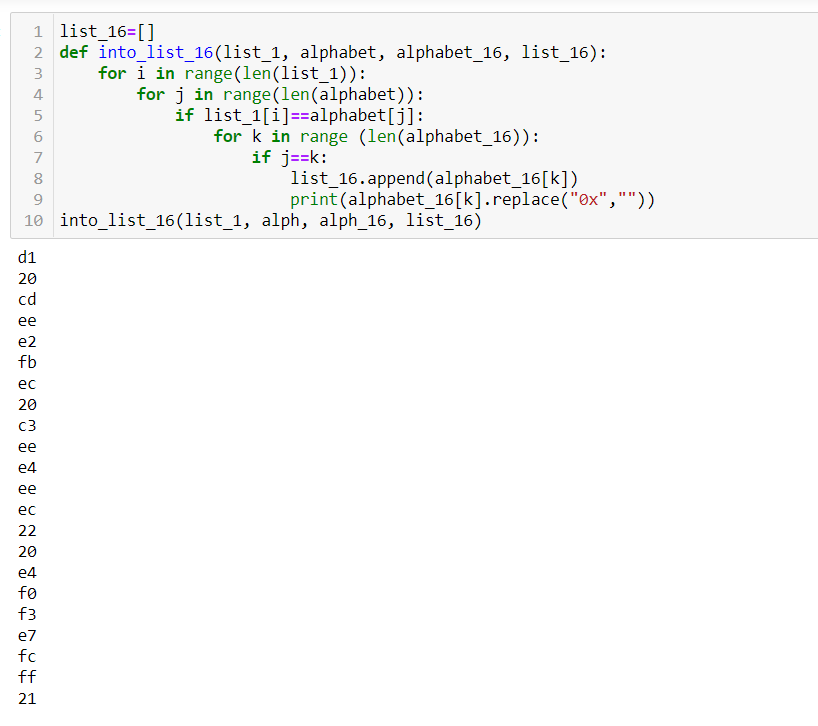
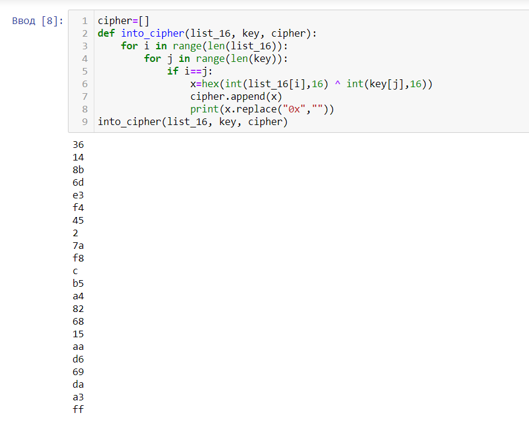
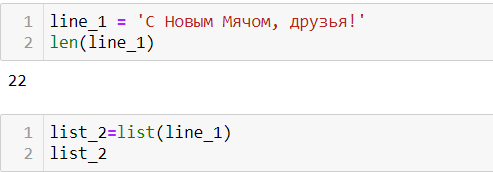
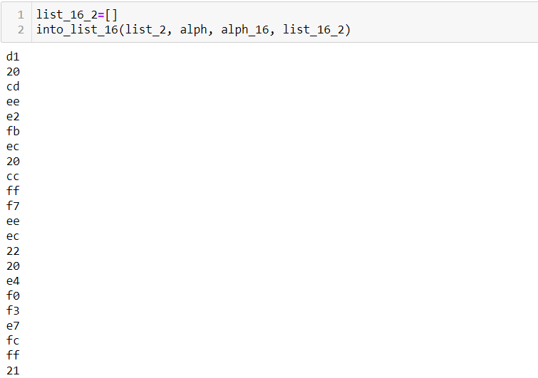
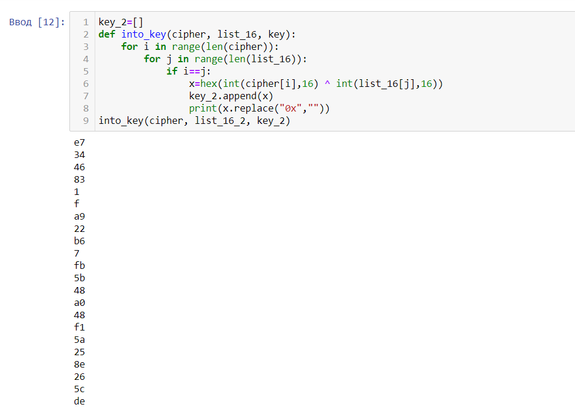

---
## Front matter
title: "Лабораторная работа №7: Элементы криптографии. Однократное гаммирование."
subtitle: "*дисциплина: Информационная безопасность*"
author: "Голова Варвара Алексеевна"
date: 2021, 11 December

## Formatting
mainfont: PT Serif
romanfont: PT Serif
sansfont: PT Sans
monofont: PT Mono
toc: false
slide_level: 2
theme: metropolis
header-includes:
 - \metroset{progressbar=frametitle,sectionpage=progressbar,numbering=fraction}
 - '\makeatletter'
 - '\beamer@ignorenonframefalse'
 - '\makeatother'
aspectratio: 43
section-titles: true

---

# Цель работы

Освоить на практике применение режима однократного гаммирования.

# Выполнение работы

## Алфавит

Задала алфавит из русских букв и алфавит из соответствующих им шестнадцетиричных чисел.

{ #fig:001 width=70% }

## Сообщение

Ввела сообщение.

{ #fig:002 width=70% }

## Ключ

Создала рандомный ключ.

{ #fig:003 width=70% }

## Перевод сообщения

Перевела заданное сообщение в шестнадцетиричные числа.

{ #fig:004 width=70% }

## Шифрование

Зашифровала сообщение с помощью ключа.

{ #fig:005 width=70% }

## Расшифровка

Один из вариантов расшифровки полученного шифра.

{ #fig:006 width=70% }

## Перевод сообщения

Перевела один из возможных вариантов расшифровки сообщения в шестнадцетиричные числа.

{ #fig:007 width=70% }

## Ключ

Получила ключ, при использовании которого могло быть получено данное сообщение.

{ #fig:008 width=70% }

# Выводы

Я освоила на практике применение режима однократного гаммирования.
