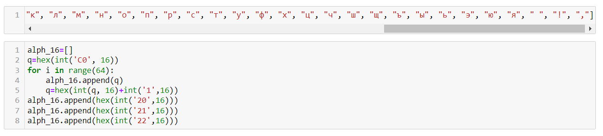
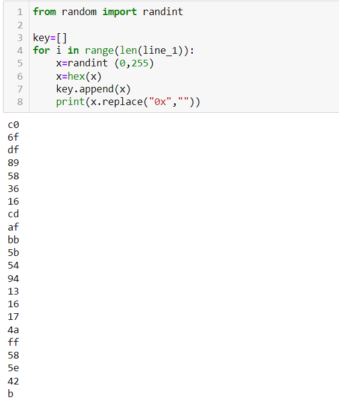
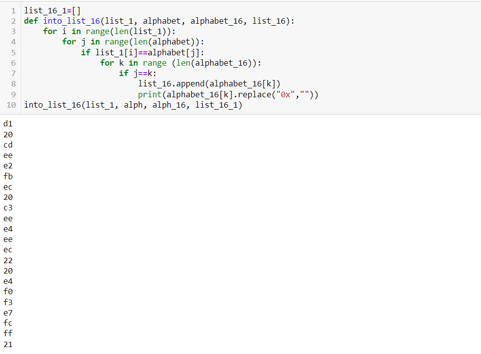
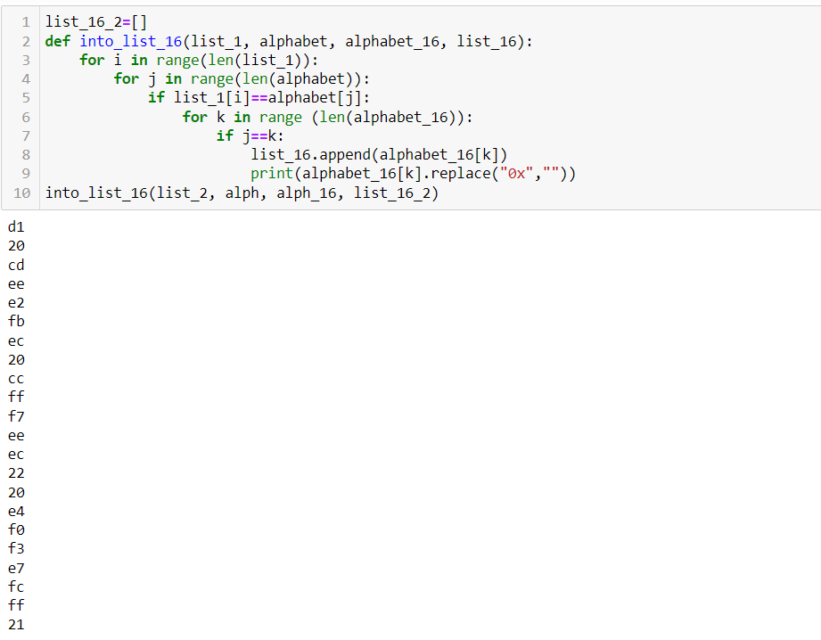
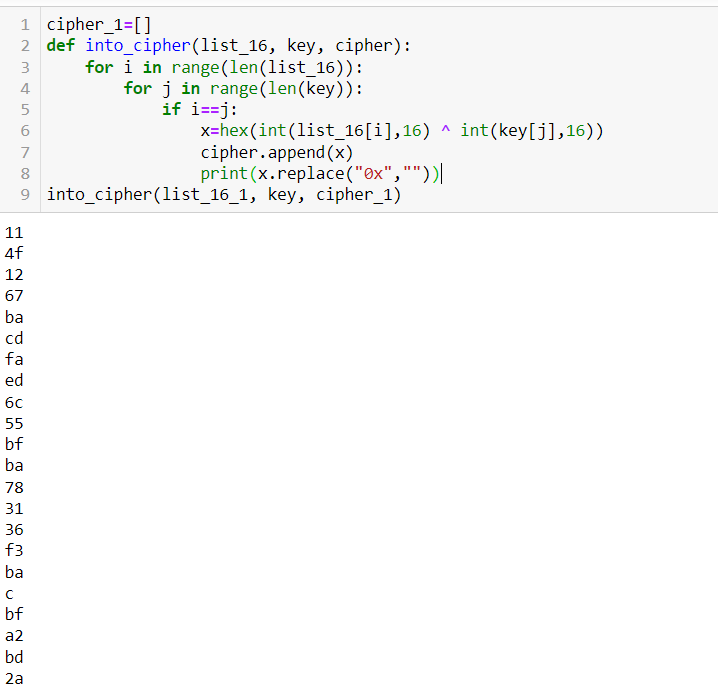
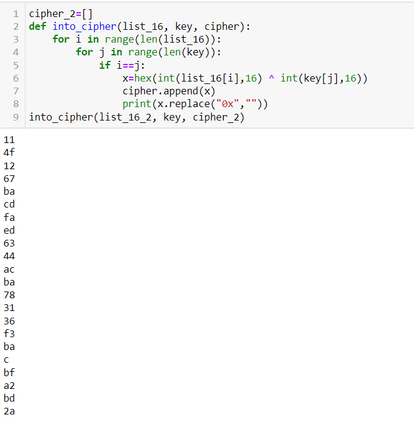
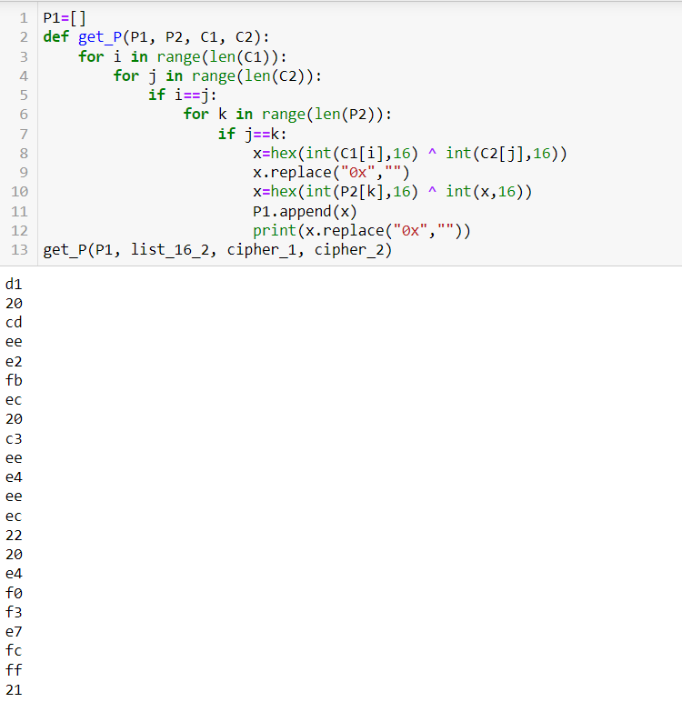
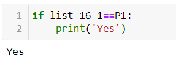

---
## Front matter
title: "Лабораторная работа №8: Элементы криптографии. Шифрование (кодирование) различных исходных текстов одним ключом."
subtitle: "*дисциплина: Информационная безопасность*"
author: "Голова Варвара Алексеевна"
date: 2021, 18 December

## Formatting
mainfont: PT Serif
romanfont: PT Serif
sansfont: PT Sans
monofont: PT Mono
toc: false
slide_level: 2
theme: metropolis
header-includes:
 - \metroset{progressbar=frametitle,sectionpage=progressbar,numbering=fraction}
 - '\makeatletter'
 - '\beamer@ignorenonframefalse'
 - '\makeatother'
aspectratio: 43
section-titles: true

---

# Цель работы

Освоить на практике применение режима однократного гаммирования на примере кодирования различных исходных текстов одним ключом.

# Выполнение работы

## Алфавит

Задала алфавит из русских букв и алфавит из соответствующих им шестнадцетиричных чисел.

{ #fig:001 width=70% }

## Сообщения

Ввела сообщения.

{ #fig:002 width=70% }

## Ключ

Создала рандомный ключ.

{ #fig:003 width=70% }

## Перевод сообщений

Перевела заданные сообщение в шестнадцетиричные числа.

{ #fig:004 width=70% }

## Перевод сообщений

Перевела заданные сообщение в шестнадцетиричные числа.

{ #fig:005 width=70% }

## Шифрование

Зашифровала сообщения с помощью ключа.

{ #fig:006 width=70% }

## Шифрование

Зашифровала сообщения с помощью ключа.

{ #fig:007 width=70% }

## Способ, прочтения одного из открытых текстов

Способ, при котором злоумышленник может прочитать оба текста, не зная ключа.

{ #fig:008 width=70% }

## Проверка

Проверка

{ #fig:009 width=70% }

# Выводы

Я освоила на практике применение режима однократного гаммирования на примере кодирования различных исходных текстов одним ключом.
